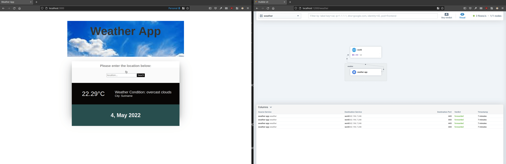
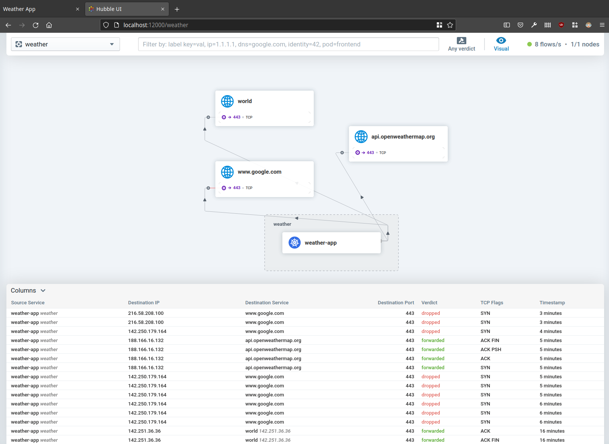

# Pre requisites
- container runtime like [docker](https://docs.docker.com/get-docker/), [podman](https://podman.io/getting-started/installation)
- [minikube](https://minikube.sigs.k8s.io/docs/start/)
- [kubectl](https://kubernetes.io/docs/tasks/tools/#kubectl)

# Create the Cluster
Start minikube with default settings:
```bash
minikube start --network-plugin=cni
```

Or start minikube with specified resource limits and driver:
```bash
minikube start --cpus=8 --memory=16384 --driver='podman' --network-plugin=cni
```

# Install Cilium
## Cilium CLI
Install the latest version of the Cilium CLI. The Cilium CLI can be used to install Cilium, inspect the state of a Cilium installation, and enable/disable various features.

## Linux
```bash
curl -L --remote-name-all https://github.com/cilium/cilium-cli/releases/latest/download/cilium-linux-amd64.tar.gz{,.sha256sum}
sha256sum --check cilium-linux-amd64.tar.gz.sha256sum
sudo tar xzvfC cilium-linux-amd64.tar.gz /usr/local/bin
rm cilium-linux-amd64.tar.gz{,.sha256sum}
```
## macOS
```bash
curl -L --remote-name-all https://github.com/cilium/cilium-cli/releases/latest/download/cilium-darwin-amd64.tar.gz{,.sha256sum}
shasum -a 256 -c cilium-darwin-amd64.tar.gz.sha256sum
sudo tar xzvfC cilium-darwin-amd64.tar.gz /usr/local/bin
rm cilium-darwin-amd64.tar.gz{,.sha256sum}
```
## Other
Download the binary for your platform from [https://github.com/cilium/cilium-cli/releases/latest](https://github.com/cilium/cilium-cli/releases/latest)

# Deploy Cilium and Hubble
Install Cilium and verify it has been properly installed.
```bash
❯ cilium install

❯ cilium status --wait
    /¯¯\
 /¯¯\__/¯¯\    Cilium:         OK
 \__/¯¯\__/    Operator:       OK
 /¯¯\__/¯¯\    Hubble:         disabled
 \__/¯¯\__/    ClusterMesh:    disabled
    \__/

DaemonSet         cilium             Desired: 1, Ready: 1/1, Available: 1/1
Deployment        cilium-operator    Desired: 1, Ready: 1/1, Available: 1/1
Containers:       cilium             Running: 1
                  cilium-operator    Running: 1
Cluster Pods:     0/1 managed by Cilium
Image versions    cilium             quay.io/cilium/cilium:v1.11.3@sha256:cb6aac121e348abd61a692c435a90a6e2ad3f25baa9915346be7b333de8a767f: 1
                  cilium-operator    quay.io/cilium/operator-generic:v1.11.3@sha256:5b81db7a32cb7e2d00bb3cf332277ec2b3be239d9e94a8d979915f4e6648c787: 1
```

Install Hubble and verify it has been properly installed.
```bash
❯ cilium hubble enable --ui

❯ cilium status --wait
    /¯¯\
 /¯¯\__/¯¯\    Cilium:         OK
 \__/¯¯\__/    Operator:       OK
 /¯¯\__/¯¯\    Hubble:         OK
 \__/¯¯\__/    ClusterMesh:    disabled
    \__/

DaemonSet         cilium             Desired: 1, Ready: 1/1, Available: 1/1
Deployment        cilium-operator    Desired: 1, Ready: 1/1, Available: 1/1
Deployment        hubble-relay       Desired: 1, Ready: 1/1, Available: 1/1
Deployment        hubble-ui          Desired: 1, Ready: 1/1, Available: 1/1
Containers:       cilium             Running: 1
                  cilium-operator    Running: 1
                  hubble-relay       Running: 1
                  hubble-ui          Running: 1
Cluster Pods:     3/3 managed by Cilium
Image versions    cilium             quay.io/cilium/cilium:v1.11.3@sha256:cb6aac121e348abd61a692c435a90a6e2ad3f25baa9915346be7b333de8a767f: 1
                  cilium-operator    quay.io/cilium/operator-generic:v1.11.3@sha256:5b81db7a32cb7e2d00bb3cf332277ec2b3be239d9e94a8d979915f4e6648c787: 1
                  hubble-relay       quay.io/cilium/hubble-relay:v1.11.3@sha256:7256ec111259a79b4f0e0f80ba4256ea23bd472e1fc3f0865975c2ed113ccb97: 1
                  hubble-ui          quay.io/cilium/hubble-ui:v0.8.5@sha256:4eaca1ec1741043cfba6066a165b3bf251590cf4ac66371c4f63fbed2224ebb4: 1
                  hubble-ui          quay.io/cilium/hubble-ui-backend:v0.8.5@sha256:2bce50cf6c32719d072706f7ceccad654bfa907b2745a496da99610776fe31ed: 1
                  hubble-ui          docker.io/envoyproxy/envoy:v1.18.4@sha256:e5c2bb2870d0e59ce917a5100311813b4ede96ce4eb0c6bfa879e3fbe3e83935: 1
```

# Weather App
We will deploy a Weather App to get familiar with Cilium and Hubble. Deploy the Weather App and forward the frontend port.

```bash
# Create the weather namespace
kubectl create namespace weather

# Switch context to the weather namespace
kubectl config set-context --current --namespace=weather

# Deploy the weather app
kubectl apply -f weather-app/

# Forward the frontend port and keep the terminal open
kubectl port-forward -n weather svc/weather-app-service 3000:80
```

Open [http://localhost:3000/](http://localhost:3000/) in your browser to access the Weather App.

# Hubble UI
Hubble provides a graphical user interface which displays a service map of your service dependencies. To access Hubble UI, you can use the following command to forward the port of the web frontend to your local machine:
```bash
# Keep this terminal open
kubectl port-forward -n kube-system svc/hubble-ui 12000:80
```

Open [http://localhost:12000](http://localhost:12000) in your browser to access the Hubble UI and select the weather namespace.

In the Weather App search for a few locations and observe the requests in the Hubble UI.


# Securing Weather App
## Scenario 1
Currently the weather app pod has access to the whole internet, we can verify this by running a curl command from the weather app pod.
```bash
# Get name of the pod
❯ kubectl get pods
NAME                           READY   STATUS    RESTARTS   AGE
weather-app-7449d64b45-wg4zd   1/1     Running   0          5m50s

# Execute a curl to google, adjust the name to your pod
❯ kubectl exec -it weather-app-7449d64b45-wg4zd -- curl -I https://www.google.com
HTTP/2 200
```

*Note that the request can also be seen in the Hubble UI.*

The weather app only needs to access `api.openweathermap.org`. Secure the weather app by creating a CiliumNetworkPolicy which enables the pod to access the openweathermap API but blocking all other traffic. You can use the online policy editor [https://editor.cilium.io/](https://editor.cilium.io/) to create the policy. After the policy has been created in the editor, save it locally and apply it:
```bash
kubectl apply -f <path/to/policy>.yml
```


After the policy has been applied, run the curl command again to verify if the traffic is now being blocked.
```bash
❯ kubectl exec -it weather-app-7449d64b45-wg4zd -- curl --connect-timeout 5 -I https://www.google.com
curl: (28) Failed to connect to www.google.com port 443 after 2723 ms: Operation timed out
command terminated with exit code 28
```

Search for a new location in the weather app and verify that it is still working. In the Hubble UI we should see traffic being dropped to url's other than that of the openweathermap API.


Cleanup the policy by deleting it:
```bash
kubectl delete -f <path/to/policy>.yml
```

## Extra's
Enable metrics: https://docs.cilium.io/en/stable/gettingstarted/grafana/#install-metrics
# References
- https://cilium.io/
- https://github.com/amreshh/weather